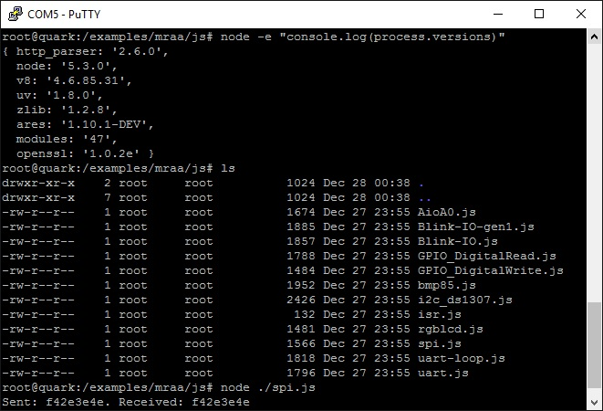
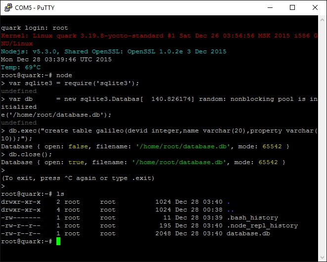
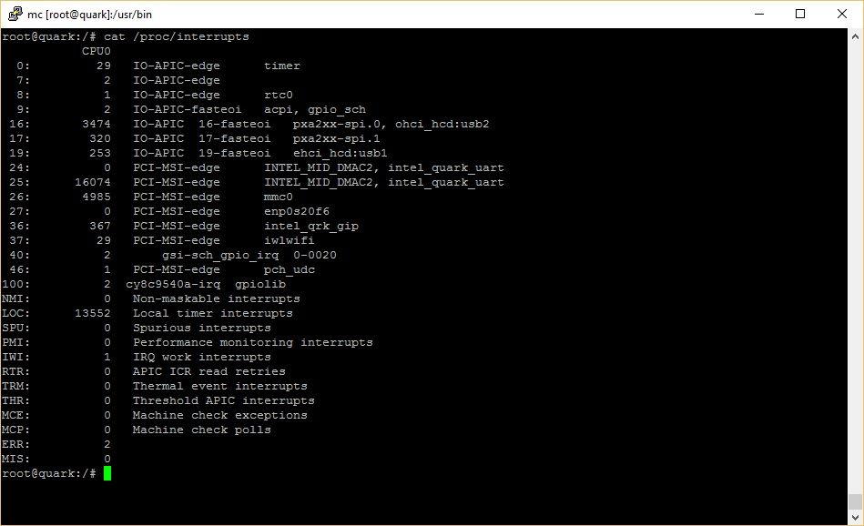
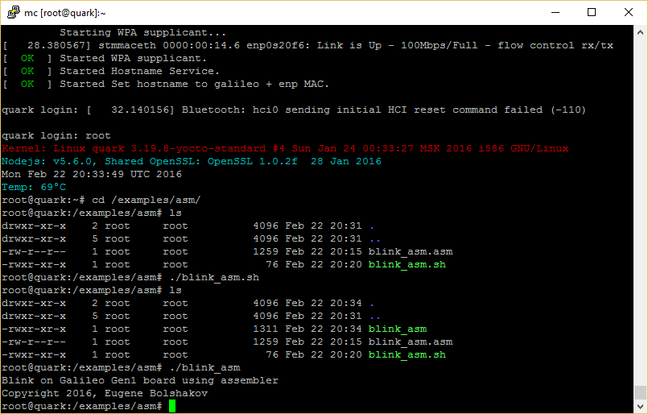

Brief
====
This SD card Linux image for Galileo Gen1/Gen2 boards is based on:
* Base: [BSP 1.2.0](https://downloadcenter.intel.com/download/23197/Intel-Quark-BSP)
* Kernel: 3.19.y (3.19.8 on 12.12.2015) with patches
* Many packets shown below

Link to download
====
[Download last version](https://relvarsoft.com/galileo/galileo_xbolshe_iot_1.2.0_kernel_v3.19.8_featured_201606261.zip)

Software packets
====
* nodeJS 6.2.2
* node-SQLite 3.1.4
* mraa 1.1.0
* upm 0.7.0
* OpenSSL 1.0.2h
* tcpdump 4.7.4
* SQLite 3.13.0
* nginx 1.11.1 (with HTTP2)
* mc 4.8.14
* madwimax 0.1.1
* hostapd 2.5
* iw 4.1
* crda 1.0.1
* B.A.T.M.A.N. 2015.2
* python 3.3.3
* wget 1.15
* nasm 2.11.05
* yasm 1.2.0
* curl 7.37.1
* usb-modeswitch 2.2.6
* ffmpeg 2.8.5
* OpenCV 3.1.0
* v4l-utils 1.9.0
* fasm 1.71.51
* binutils 2.24
* gdb 7.7.1
* strace 4.8
* make 4.0
* cmake 3.4.2
* netsnmp 5.7.3
* gcc 4.9.1
* lshw B.02.17
* i2c-tools 3.1.1
* bluez 5.39
* tinyb 0.4.3

Screenshots
====

* NodeJS 5.x on Galileo board

* SQLite3 with NodeJS 5.3

* Separated interrupts

* blink assembler application

Changelog
====

Changelog is available [here](CHANGELOG.md)

xbolshe
