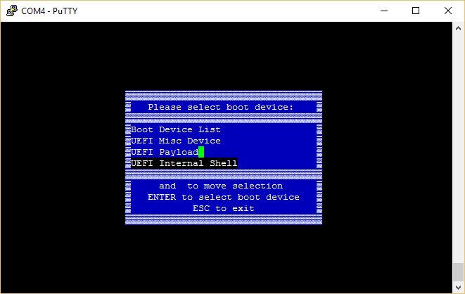
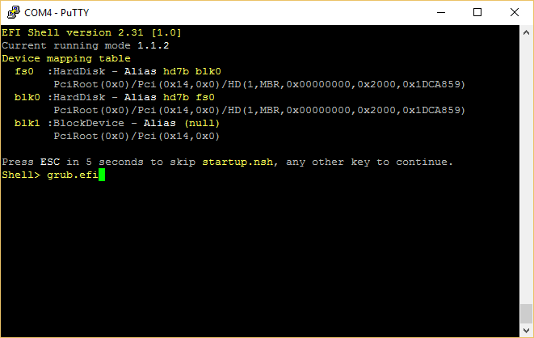
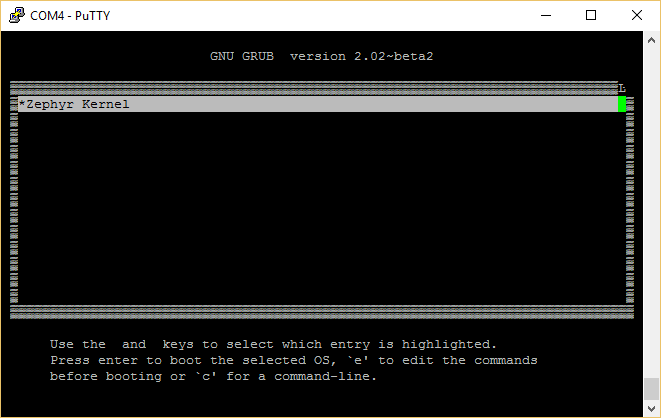
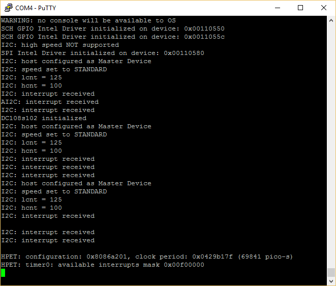

Zephyr demo image
====
This SD card Linux image for Galileo Gen2 board is based on [Zephyr v1.0.0](https://www.zephyrproject.org/downloads)

Download image
====
[Download image](zephyr_demo_compiled_by_xbolshe.zip)

Screenshots
====

xbolshe
